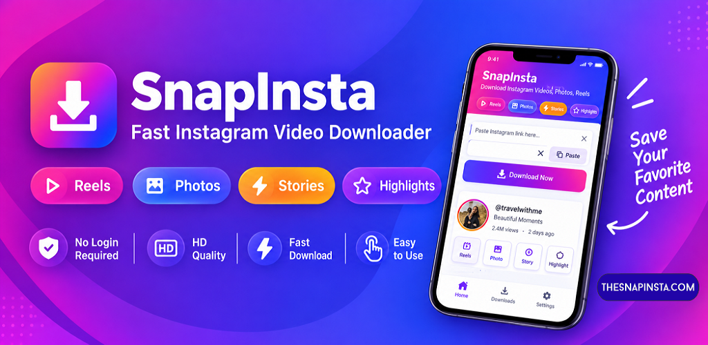
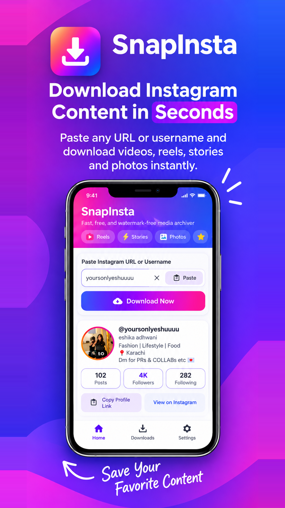
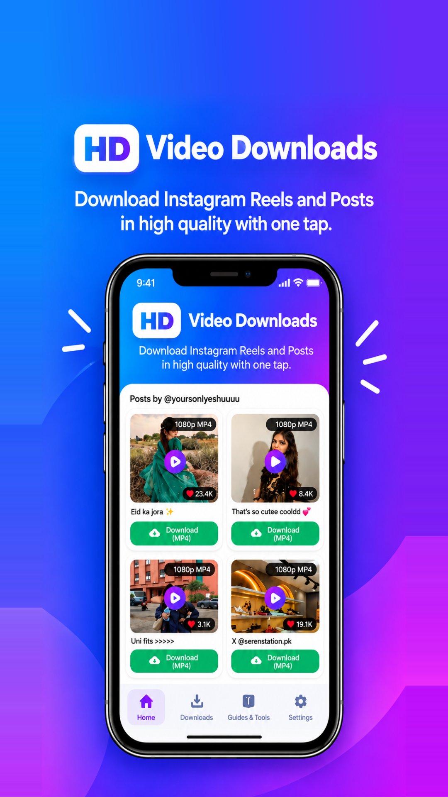
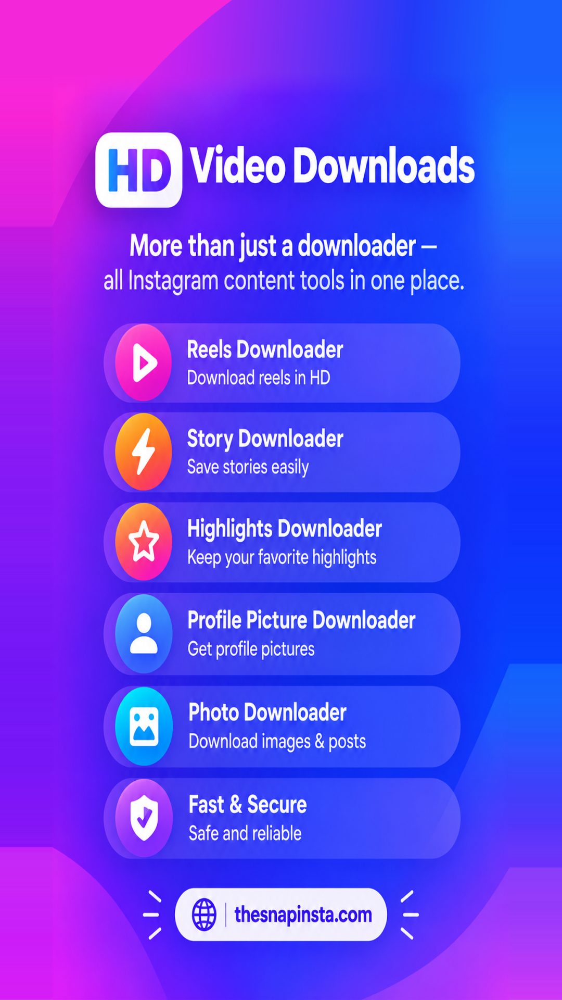

# 📸 SnapInsta — Instagram Reels, Story & Video Downloader (Android & Web)

  

  
  
  
  

---

## 🌐 Official Web Portal & Free Online Tool
> Access the lightning-fast web downloader on any browser (PC, Mac, iPhone, Android):  
> 👉 **[Visit https://thesnapinsta.com](https://thesnapinsta.com)** 👈

---

## 📱 About SnapInsta Android App
**SnapInsta** is a lightweight, ultra-fast, and secure Android utility application designed to help users download and archive public Instagram content in original Full HD quality (1080p / 4K) without watermarks or login requirements.

Whether you need to save inspiring Reels, preserve 24-hour Stories before they expire, archive Story Highlights, or download carousel photo albums in their original resolution, SnapInsta makes it seamless and instant.

* **Package Name:** `com.thesnapinsta.app`
* **Version:** `1.0.0`
* **APK File Size:** `2.39 MB` (Ultra Lightweight)
* **Minimum Android:** `Android 7.0 (API 24)` or higher
* **Official Website:** **[https://thesnapinsta.com](https://thesnapinsta.com)**

---

## 🚀 Key Features

* ⚡ **1080p Full HD Video Downloads:** Download public Instagram Reels and high-bitrate MP4 videos at maximum quality.
* 🕒 **Story & Highlights Archiver:** Save active 24-hour stories and full story highlight albums with one tap.
* 🖼️ **Ultra HD Photo & Carousel Saver:** Download single photos and multi-slide carousels in full original resolution without compression.
* 🎵 **Direct Audio (MP3) Extraction:** Extract background audio and music tracks directly from Instagram videos.
* 👤 **Public Profile Viewer:** Explore public usernames to view and browse their posts, reels, and stories.
* 🔒 **100% Private & No Login Required:** You never need to enter your Instagram credentials. Complete peace of mind with zero data tracking.
* 📂 **Built-in Downloads Manager:** Play, preview, share, and manage your saved files directly inside the app gallery.

---

## 📸 App Screenshots

  
  &nbsp;&nbsp;
  
  &nbsp;&nbsp;
  

---

## 📥 Download & Installation

### Option 1: Direct APK Download
1. Download the latest release: **[`SnapInsta-Release.apk`](SnapInsta-Release.apk)** (2.39 MB).
2. Open the downloaded `.apk` file on your Android device.
3. If prompted, allow "Install from Unknown Sources" in your Android Settings.
4. Tap **Install** and enjoy unlimited fast downloads!

### Option 2: Online Web Tool (No App Needed)
Prefer not to install an app? You can use the web version directly from any device:  
👉 **[Open TheSnapInsta.com Online Downloader](https://thesnapinsta.com)**

---

## 💡 How It Works

1. Open Instagram and copy the link of any public Reel, Video, Story, or Post.
2. Open **SnapInsta** (or visit **[https://thesnapinsta.com](https://thesnapinsta.com)**).
3. The app will automatically detect or let you tap **"Paste"**.
4. Tap **"Download Now"** — your media will be saved to your device gallery instantly!

---

## 🔗 Online Tools & Services by TheSnapInsta

Explore our suite of free online Instagram utility tools:
* 🎬 **[Instagram Reels Downloader](https://thesnapinsta.com)** — Fast high-resolution MP4 downloads.
* 📖 **[Instagram Story Saver](https://thesnapinsta.com)** — Save stories and highlights anonymously.
* 📷 **[Instagram Photo Downloader](https://thesnapinsta.com)** — High quality photo and carousel saver.
* 🎧 **[Instagram Audio Downloader](https://thesnapinsta.com)** — Convert Instagram videos to MP3 audio.
* 🔍 **[Instagram Profile & DP Viewer](https://thesnapinsta.com)** — View public profile pictures in full size.

---

## ⚖️ Legal Disclaimer
SnapInsta is an independent third-party utility tool and is **NOT** affiliated with, authorized, sponsored, or endorsed by Instagram or Meta Platforms, Inc. All trademarks, logos, and brand names are the property of their respective owners. SnapInsta is built strictly for personal archiving and backup of public media. Users are responsible for respecting copyright laws and content creators' rights.

* **Official Website:** [https://thesnapinsta.com](https://thesnapinsta.com)
* **Privacy Policy:** [https://thesnapinsta.com/privacy-policy](https://thesnapinsta.com/privacy-policy)
* **Terms of Service:** [https://thesnapinsta.com/terms-and-conditions](https://thesnapinsta.com/terms-and-conditions)
* **Support Email:** `nextdevstack@gmail.com`

---

## 📄 License
This project documentation and release assets are licensed under the [MIT License](LICENSE).
